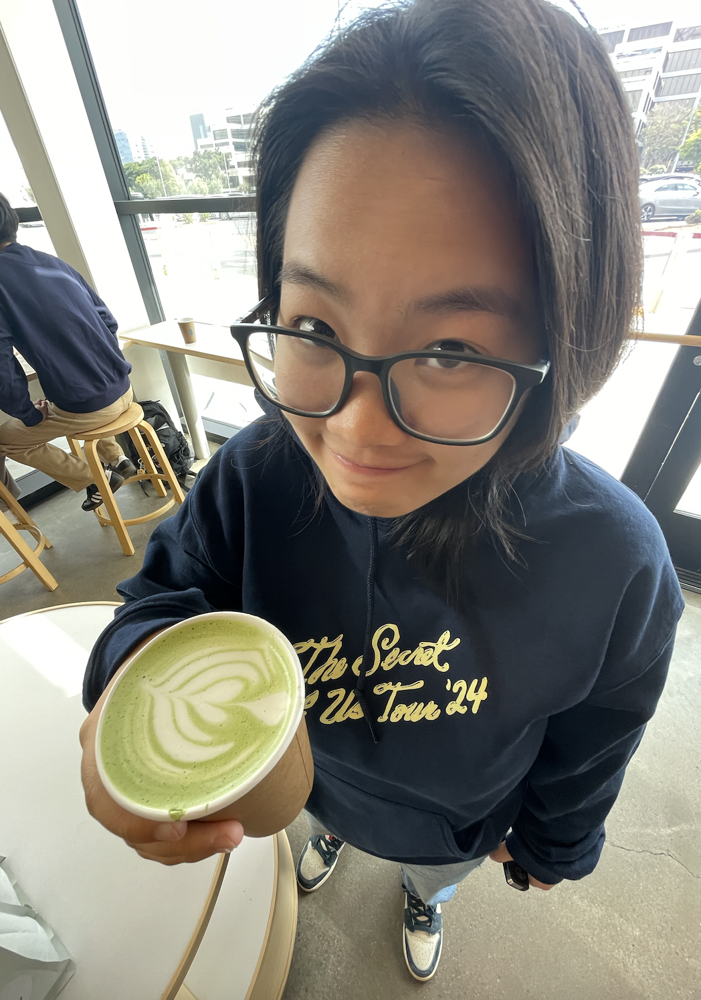

# My User Page

## Introduction
**Name:** Terri Tai\
 
**Major:** Computer Engineering\
**Grad Year:** 2027

## Clubs
> Women in Computing\
> Institute of Electrical and Electronic Engineers

## Fun Facts
*Favourite Git command:*
```
git commit -m "fun facts"
```

*Hobbies:*
> Playing guitar\
> Performing magic

*Languages I know:*
- Python
- Java
- C
- C++
- ARM32
- HTML
- CSS

*Languages I know ranked:*
1. Java
2. Python
3. C++
4. HTML
5. CSS
6. C
7. ARM32

*To-Do:*
- [ ] Get an internship :cold_sweat:

Here is my [LinkedIn](https://www.linkedin.com/in/terri-tai-732a21229/)\
Here is the [Introduction Section](#introduction)\
Here is the [Clubs Section](#clubs)\
Here is the [Fun Facts Section](#fun-facts)

## <ins>The End</ins> ##
